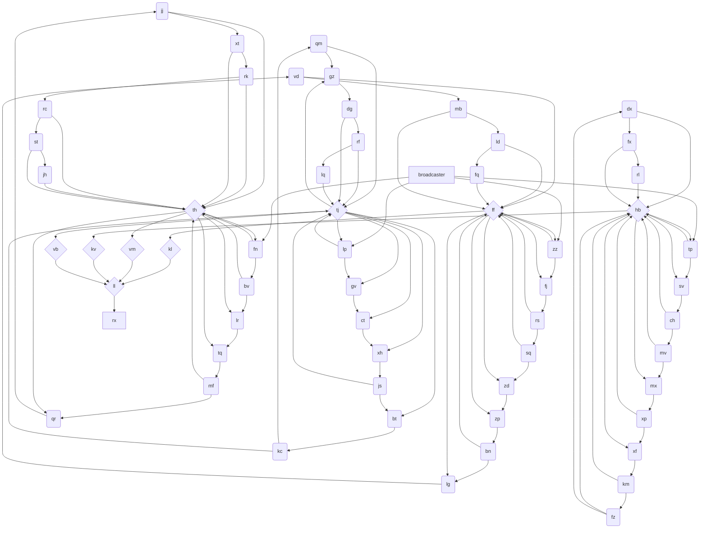

```mermaid
flowchart TD
  kl{kl}-->ll
  vd(vd)-->ff & mb
  dx(dx)-->hb & fx
  jj(jj)-->xt & th
  ld(ld)-->fq & ff
  bn(bn)-->ff & lg
  mv(mv)-->hb & mx
  mx(mx)-->xp
  qm(qm)-->gz & tj
  zd(zd)-->zp
  tq(tq)-->mf
  vm{vm}-->ll
  qr(qr)-->jj
  bv(bv)-->th & lr
  rf(rf)-->lq & tj
  broadcaster--->lp & fn & tp & zz
  rk(rk)-->rc & th
  tj{tj}-->xh & gv & gz & bt & ct & vb & lp
  dg(dg)-->rf & tj
  xt(xt)-->rk & th
  fq(fq)-->ff
  gz(gz)-->dg
  rl(rl)-->hb
  rc(rc)-->st & th
  km(km)-->fz & hb
  gv(gv)-->ct
  lr(lr)-->tq
  lg(lg)-->vd
  jh(jh)-->th
  rs(rs)-->sq & ff
  bt(bt)-->kc
  mf(mf)-->th & qr
  xf(xf)-->km
  tp(tp)-->hb & sv
  ch(ch)-->hb & mv
  xp(xp)-->hb & xf
  xh(xh)-->js
  fz(fz)-->hb & dx
  zp(zp)-->bn
  kv{kv}-->ll
  ll{ll}-->rx
  zz(zz)-->fj & ff
  lp(lp)-->gv & tj
  vb{vb}-->ll
  th{th}-->tq & lr & vm & fn & qr
  sq(sq)-->zd & ff
  st(st)-->th & jh
  fx(fx)-->rl & hb
  fj(fj)-->rs
  lq(lq)-->tj
  fn(fn)-->th & bv
  ct(ct)-->xh
  ff{ff}-->kl & zd & lg & zz & fj & zp
  js(js)-->tj & bt
  mb(mb)-->ld & ff
  hb{hb}-->sv & xf & kv & tp & mx
  kc(kc)-->qm & tj
  sv(sv)-->ch
```